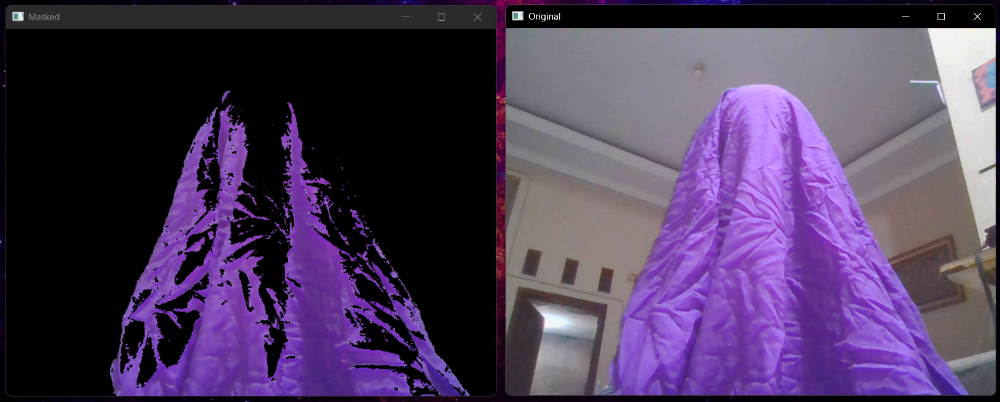

#  Tracking Using HSV - Object Detection

In this example, I tried to track objects with **purple colors**.  

I used **Trackbars** to dynamically manipulate the HSV range for purple detection.  
The results are expressed in terms of:

```
Lower HSV: (125, 100, 50)  
Upper HSV: (160, 255, 200)
```

> These values can be adjusted using the trackbars for better accuracy depending on the lighting conditions and shade of purple.

---

## 🧰 Required Modules

Install the following Python modules before running the code:

- **NumPy**  
  ```
  pip install numpy
  ```

- **OpenCV**  
  ```
  pip install opencv-python
  ```

---

## 🖼️ Results

Real-time purple object detection using webcam:



---

## 🎯 Purpose

This mini-project helps to understand how **color segmentation** using **HSV color space** works in OpenCV.  
By changing the HSV range, you can easily switch to detecting different colors too (e.g., red, green, blue).

---

## 💡 Tips

- Make sure lighting is consistent.
- Avoid background colors that are close to purple.
- Fine-tune the trackbar values for best performance.

---

> Made by [Muhammad Yusuf Aditiya]